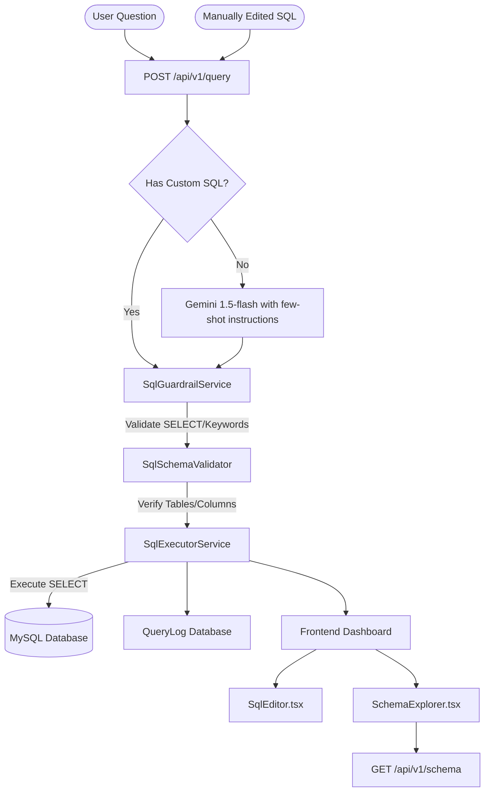

# Text-to-SQL Interface with Guardrails

A portfolio-grade, full-stack AI engineering application that translates natural language business questions into SQL queries, executes them safely against a MySQL database using a rigorous security guardrail and schema validation pipeline, and renders interactive visualizations.

---

## 🌟 Engineering Value & Portfolio Readiness

This is not a simple wrapper around an LLM API. It demonstrates a production-hardened, secure, and resilient system pattern for exposing relational database assets to generative AI:

1. **LLM Output Structuring**: Enforces strict JSON schemas on generative completions (`sql`, `confidence`, `explanation`) using Gemini 1.5-flash options.
2. **Multi-Stage Security Gateways**: Separates query generation from query validation. AI outputs and user-edited queries must pass through independent validation layers *before* touching the database.
3. **Database-Aware Validation**: Inspects queries statically to verify referenced tables and columns exist, preventing syntax exception leakage and database crashes.
4. **Resiliency and Timeouts**: Connect timeouts (5s) and request timeouts (10s) prevent server connection exhaustion. Raw database trace exceptions are caught and generalized in production environments.
5. **Interactive Workspaces**: Allows developers/analysts to edit, re-validate, and re-execute queries while maintaining 100% of the guardrail protection.
6. **Zero-Dependency SVG Visualizations**: Dynamically checks results to render SVG-based distribution bars and chronological trend lines with tooltips, fully compatible with React 19 / Next.js 15.

---

## 🛡️ Why Text-to-SQL Needs Guardrails

Generative AI models are prone to hallucination, formatting variations, and instruction-drift. Letting an AI write and execute SQL against an database without guardrails exposes systems to:
- **Destructive Statements**: An AI might translate a prompt into a `DROP TABLE`, `TRUNCATE`, or `DELETE` statement.
- **SQL Injections**: A user could inject a prompt designed to append malicious subqueries (e.g. `'; DROP TABLE users--`).
- **Schema Conflicts**: Hallucinated table/column names cause database connection exceptions, which can expose structural names or paths to the frontend.
- **Denial of Service (DoS)**: Inefficient or massive Cartesian joins can lock up CPU and memory.

Our **Security Pipeline** prevents this by validating queries at the string, token, and database levels.

---

## 📊 Technical Architecture & System Pipelines



### 1. SQL Guardrails (SqlGuardrailService)
- **Select-Only Check**: Asserts query starts with `SELECT`.
- **Semicolon Check**: Blocks multiple statements.
- **Forbidden Keyword Audit**: Strips string literals and blocks `INSERT`, `UPDATE`, `DELETE`, `DROP`, `ALTER`, `TRUNCATE`, `CREATE`, `GRANT`, `REVOKE`, `INTO`, `LOAD`, `REPLACE`, `SHOW`, `LOCK`.

### 2. Schema Validation (SqlSchemaValidator)
- Extracts referenced tables following `FROM`/`JOIN`.
- Strips string literals and verifies all identifiers (columns) exist in the retrieved database schema, bypassing SQL functions and aliases.

---

## 🛠️ Technology Stack
- **Backend**: Laravel 11, Eloquent ORM, PHPUnit.
- **Frontend**: Next.js 15 (App Router), TypeScript, Tailwind CSS v4.
- **Database**: MySQL 8.0.
- **AI Integrations**: Gemini 1.5-flash API via Server-Side HTTP Client.

---

## 📁 API Endpoints

### 1. Execute SQL / Question
- **Endpoint**: `POST /api/v1/query`
- **Body**:
  ```json
  {
    "question": "Show total sales by month.",
    "sql": "SELECT DATE_FORMAT(order_date, '%Y-%m') AS month, SUM(total_amount) AS revenue FROM orders GROUP BY month"
  }
  ```
- **Response**:
  ```json
  {
    "question": "Show total sales by month.",
    "sql": "SELECT ...",
    "guardrails": { "allowed": true, "reason": null },
    "schema_validation": { "valid": true, "reason": null },
    "execution": {
      "success": true,
      "error": null,
      "time_ms": 14.5,
      "results": [ { "month": "2026-08", "revenue": 1420.50 } ]
    },
    "confidence": null,
    "explanation": "Executed custom user-edited SQL query."
  }
  ```

### 2. Schema Explorer
- **Endpoint**: `GET /api/v1/schema`
- **Response**:
  ```json
  {
    "success": true,
    "data": {
      "tables": [
        {
          "name": "customers",
          "columns": [ { "name": "id", "type": "bigint (PK)" } ]
        }
      ],
      "relationships": [
        { "from": "orders.customer_id", "to": "customers.id", "label": "belongs to customer" }
      ]
    }
  }
  ```

### 3. Query History Logs
- **Endpoint**: `GET /api/v1/history`

---

## 🚀 Setup Instructions

### Backend (Laravel)
1. Navigate to `/backend`.
2. Install dependencies:
   ```bash
   composer install
   ```
3. Copy `.env.example` to `.env` and set up database/CORS details:
   ```env
   DB_CONNECTION=mysql
   DB_HOST=127.0.0.1
   DB_PORT=3306
   DB_DATABASE=text_to_sql
   DB_USERNAME=root
   DB_PASSWORD=
   
   AI_PROVIDER=gemini
   GEMINI_API_KEY=your_gemini_api_key
   ALLOWED_CORS_ORIGINS=http://localhost:3000
   ```
4. Run migrations and seed data:
   ```bash
   php artisan migrate --seed
   ```
5. Run server:
   ```bash
   php artisan serve --port=8001
   ```

### Frontend (Next.js)
1. Navigate to `/frontend`.
2. Install dependencies:
   ```bash
   npm install
   ```
3. Create `.env.local` pointing to backend port 8001:
   ```env
   NEXT_PUBLIC_API_URL=http://localhost:8001/api/v1
   ```
4. Start dev server:
   ```bash
   npm run dev
   ```

---

## 🧪 Testing Verification

Run the 18-point feature test suite containing API timeout checks, forbidden string exception bypasses, error suppressions, and validations:
```bash
php artisan test
```

To compile the frontend:
```bash
npm run build
```
