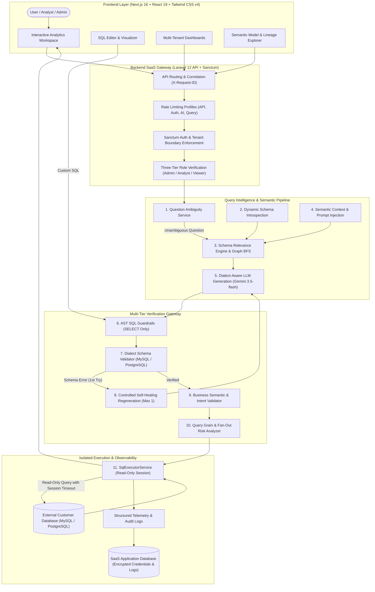

# Text-to-SQL Analytics Platform

> **Enterprise-grade, multi-tenant Text-to-SQL SaaS built around one central engineering challenge: *"Can we trust the answer?"***
> Combines dialect-aware LLM SQL generation with AST guardrails, dynamic schema intelligence, company-scoped business semantic modeling, relational grain/fan-out analysis, read-only isolated execution, and end-to-end production observability.

---

## 🌟 Why This Project Is Interesting

Most Text-to-SQL demonstrations are brittle LLM wrappers: they send an ambiguous user prompt to an AI model, inject a raw table schema, and execute whatever SQL string is returned directly against a production database.

In business environments, this approach fails catastrophically:
- **It generates dangerous SQL**: Statements can drop tables, overwrite records, or exfiltrate private credentials.
- **It generates *valid* SQL that produces the *wrong business answer***: An unconstrained `SELECT SUM(amount) FROM payments` succeeds without error, yet reports inaccurate corporate revenue because failed, pending, and refunded transactions were never filtered out.
- **It falls into join & fan-out multiplication traps (Chasm Trap)**: Joining 1:N parent-child relations (e.g. `orders` to `order_items`) multiplies parent totals across child records, silently inflating financial metrics by orders of magnitude.
- **It queries the wrong data sources**: Staging tables, pre-ingestion tables, or historical archive tables are selected instead of canonical production sources.
- **It creates operational downtime**: Unbounded queries without `LIMIT` clauses or execution timeouts crash customer databases and exhaust application memory.

This platform solves these problems through a **defense-in-depth, 8-layer validation and execution pipeline**. Every query is verified for syntax safety, dialect-specific schema validity, business metric alignment, query grain compatibility, and tenant data isolation before a single byte of data is queried.

---

## 🛡️ The Problem: Why Vanilla Text-to-SQL Is Insufficient

| Real-World Failure Mode | Vanilla LLM Text-to-SQL | This Platform's Defense |
| :--- | :--- | :--- |
| **Destructive Commands** | Translates prompt to `DROP`, `DELETE`, or `TRUNCATE` | **AST SQL Guardrails**: Strips string literals and blocks all non-`SELECT` statements before execution. |
| **Hallucinated Schema** | Hallucinates column/table names, leaking PDO error stacks | **Dynamic Schema Validation**: Validates all AST-referenced identifiers against verified database metadata. |
| **Silent Metric Drift** | Computes `SUM(amount)` ignoring business filters (`WHERE status = 'completed'`) | **Semantic Metric Validation**: Compares query AST against company-defined canonical metrics and flags missing filters. |
| **Fan-Out Multiplication** | Computes `SUM(orders.total)` joined to `order_items`, multiplying amounts | **Relational Grain & Fan-Out Analysis**: Computes output grain and warns users when 1:N joins inflate parent metrics. |
| **Staging/Archive Contamination** | Queries `staging_orders` or `archive_payments` | **Table Governance & Classifications**: Flags queries touching staging or archive data sources. |
| **Unbounded Query DoS** | Executes `SELECT *` across millions of rows, locking the DB | **Driver Session Timeouts & Row Caps**: Enforces driver-level session timeouts and caps output at 1,000 rows. |
| **Tenant Data Cross-Talk** | Queries run against the SaaS platform DB or other tenants | **Strict Isolation**: Customer queries run strictly against external customer databases using dynamic runtime connections. |

---

## 🏛️ System Architecture



---

## 🔄 The Layered Execution Pipeline

Every inquiry flows through an orchestrated pipeline ensuring safety, accuracy, and predictability:

```
User Question
  ↓
1. Business Semantic Context (Injects company-defined canonical metrics, rules & synonyms)
  ↓
2. Dynamic Schema Relevance (Selects relevant tables via BFS graph traversal over foreign keys)
  ↓
3. AI SQL Generation (Synthesizes dialect-specific SQL using structured LLM schemas)
  ↓
4. SQL Guardrails (Enforces SELECT-only statements; strips literals; blocks non-SELECT keywords)
  ↓
5. Schema Validation (Validates all tables, columns, and dialect functions against introspected schema)
  ↓
6. Controlled Self-Healing (Feeds exact validation error back to AI for 1 controlled correction)
  ↓
7. Semantic Intent Verification (Verifies SQL semantics match user question intent)
  ↓
8. Business Metric Validation (Asserts required filters like status = 'completed' are applied)
  ↓
9. Relational Grain & Fan-Out Analysis (Detects 1:N multiplication risks across parent aggregations)
  ↓
10. Read-Only Isolated Execution (Sets session timeouts and executes with row-truncation caps)
  ↓
Results, Visualizations & Correlated Telemetry
```

---

## ⚡ Feature Summary

### 🤖 AI & Correctness
- **Dialect-Aware Generation**: Generates native MySQL and PostgreSQL syntax, leveraging dialect-specific date functions (`DATE_FORMAT`, `DATE_TRUNC`, `EXTRACT`).
- **Controlled Self-Healing Regeneration**: If generated SQL fails schema or semantic validation, the system executes **at most 1 controlled correction attempt** feeding the exact error back to the LLM.
- **Ambiguity Detection**: Detects metric-vague, period-vague, or entity-vague questions before consuming LLM tokens, returning structured clarification options and suggestion chips.
- **Query Complexity Detection**: Analyzes AST structures for unbounded `SELECT *`, Cartesian products (`CROSS JOIN`), and excessive multi-table joins.

### 🛡️ Security & Guardrails
- **AST SQL Guardrails**: Strictly enforces `SELECT`-only execution. Pre-processes strings to eliminate false positives while blocking dangerous keywords (`INSERT`, `UPDATE`, `DELETE`, `DROP`, `ALTER`, `TRUNCATE`, `GRANT`, `REVOKE`, etc.).
- **Read-Only Session Timeouts**: Sets driver-level session timeouts (`SET SESSION max_execution_time` for MySQL; `SET statement_timeout` for PostgreSQL) preventing unkillable query locks.
- **Encrypted Credentials**: External database passwords are encrypted at rest using AES-256. Passwords are never returned in JSON payloads, logs, or LLM prompts.
- **Formula Injection Defense**: Spreadsheet export sanitizes CSV output cells starting with `=`, `+`, `-`, `@`, `\t`, `\r` by prefixing with `'`.

### 🏢 Multi-Tenancy & RBAC
- **Strict Tenant Boundaries**: Global Eloquent scopes (`CompanyScope`) isolate all resources (saved queries, dashboards, database connections, semantic metrics).
- **Three-Tier Role Hierarchy**:
  - **Admin**: Full administrative privileges over team members, customer database connections, semantic metrics, table classifications, and queries.
  - **Analyst**: Access to query workspace, saved queries, dashboards, and schema explorers; read-only access to team and semantic definitions.
  - **Viewer**: Read-only access restricted to company-shared saved queries and dashboards; arbitrary query execution is blocked.
- **Anti-Lockout & Asset Preservation**: Admins cannot demote themselves; the last company admin cannot be removed; member removal preserves shared company assets via `ON DELETE SET NULL`.

### 📊 Business Semantics (Phase 9)
- **Canonical Metrics**: Company-defined single sources of truth with explicit source tables, columns, aggregations, and mandatory filter conditions.
- **Business Terminology Mapping**: Maps company jargon, abbreviations, and ambiguous business concepts to canonical entities.
- **Table Governance & Classifications**: Categorizes tables into `business`, `staging`, `archive`, `test`, and `internal`.
- **Data Lineage Visualizer**: Directed node-edge graph tracing multi-tier relationships: `Canonical Metric → Source Column / Filter → Source Table → Foreign Key Joins`.
- **Semantic Drift Detection**: Saved queries store an immutable semantic snapshot; if corporate definitions evolve, visual diff banners highlight formula discrepancies.

### 📈 Dashboards & Visual Analytics
- **Zero-Bypass Architecture**: Dashboards execute saved queries through the full security and validation pipeline.
- **Partial Failure Resilience**: Broken widgets (e.g. dropped customer tables) fail gracefully in isolation without breaking the rest of the dashboard.
- **Global Date Range Engine**: Injects parameterized date filters into supported widget queries using PDO placeholders without raw string concatenation.
- **Interactive SVG Visualizations**: Responsive, zero-dependency SVG distribution bars, chronological trend lines with tooltips, and KPI metric counters.
- **RFC 4180 CSV & Executive Summary**: Export filtered dashboard data as RFC 4180 streaming CSV with Excel UTF-8 BOM or download structured executive summaries.

### 🔍 Reliability & Observability (Phase 10)
- **Multi-Profile Rate Limiting**: Dedicated rate limits for general API (`120/min`), AI generation (`20/min`), query execution (`30/min`), and authentication (`10/min`).
- **End-to-End Request Correlation (`X-Request-ID`)**: Correlates every HTTP transaction through API middleware, structured logs (`Log::withContext`), and frontend copyable badges.
- **Operational Health & Readiness Probes**: Separate HTTP liveness (`/api/health`) and readiness (`/api/ready`) probes. Customer database downtime is isolated from SaaS readiness.
- **Customer DB Latency Probing**: Active health check endpoint (`/api/v1/database-connections/{id}/health`) measuring connection latency in milliseconds.

---

## 🛠️ Technology Stack

### Frontend
- **Framework**: [Next.js 16.3](https://nextjs.org/) (App Router, React 19 Server/Client Components, Turbopack)
- **Language**: [TypeScript 5](https://www.typescriptlang.org/)
- **Styling**: [Tailwind CSS v4](https://tailwindcss.com/)
- **Typography**: Outfit & Inter (Google Fonts via `next/font`)
- **Charts**: Zero-dependency, lightweight, responsive SVG visualizers

### Backend
- **Framework**: [Laravel 12](https://laravel.com/)
- **Language**: [PHP 8.2+](https://www.php.net/)
- **Authentication**: [Laravel Sanctum](https://laravel.com/docs/sanctum) (Bearer Token SPA Authentication)
- **Testing**: [PHPUnit 11](https://phpunit.de/)

### Databases
- **Application Database**: MySQL 8.0 (internal tenant, user, query, and dashboard metadata)
- **Customer Databases Supported**: MySQL 8.0 & PostgreSQL 14+ (external runtime connections)

### AI Integration
- **Engine**: [Google Gemini 3.5-flash](https://ai.google.dev/) via structured JSON schema completions

---

## 🎯 Realistic Demo Scenario: Valid SQL vs. Business Truth

To understand why this platform exists, consider the following real-world scenario:

### The Business Question
> *"What was our total revenue last month?"*

### ❌ What Vanilla AI Generates
```sql
SELECT SUM(total_amount) AS revenue 
FROM orders 
WHERE order_date >= '2026-08-01' AND order_date <= '2026-08-31';
```
- **The Problem**: This query executes cleanly and returns a number. However, it includes **cancelled, refunded, and fraudulent orders**. In an enterprise context, this answer is **factually wrong** and misleads leadership.

### ✅ What This Platform Enforces
1. **Semantic Metric Injection**: The platform's `SemanticContextService` retrieves the company's canonical metric definition:
   - **Metric**: `Revenue`
   - **Source Table**: `orders` (Classified as `business` source of truth)
   - **Source Column**: `total_amount`
   - **Aggregation**: `SUM`
   - **Mandatory Filter**: `status = 'completed'`
2. **Dialect-Aware Generation**: Gemini synthesizes the query constrained by the injected business rules:
   ```sql
   SELECT SUM(orders.total_amount) AS total_revenue
   FROM orders
   WHERE orders.status = 'completed'
     AND orders.order_date >= '2026-08-01'
     AND orders.order_date <= '2026-08-31';
   ```
3. **AST Semantic Validation**: `SqlSemanticValidator` parses the AST and verifies:
   - Target table is a `business` table (not `staging_orders` or `archive_orders`).
   - The required predicate `status = 'completed'` is present in the `WHERE` clause.
4. **Relational Grain & Fan-Out Analysis**: Asserts that no 1:N join with `order_items` exists that would multiply order amounts.
5. **Read-Only Session Execution**: Executes with driver session timeout and caps result at 1,000 rows.
6. **Result**: A verified, audit-logged business answer you can trust.

---

## 👥 Role-Based Access Control (RBAC)

The platform enforces a three-tier permission model across company boundaries:

| Permission / Action | Admin | Analyst | Viewer |
| :--- | :---: | :---: | :---: |
| **Manage Team** (Invite, change roles, remove) | ✅ Full | ❌ Forbidden | ❌ Forbidden |
| **Manage Database Connections** (Add, test, delete) | ✅ Full | ❌ Forbidden | ❌ Forbidden |
| **Manage Semantic Model** (Metrics, terms, classifications) | ✅ Full | ❌ Read-only | ❌ Read-only |
| **Interactive Query Workspace** (Natural language & SQL) | ✅ Full | ✅ Full (with guardrails) | ❌ Restricted |
| **Execute Customer Database Queries** | ✅ Yes | ✅ Yes (credential-free) | ❌ Pre-approved only |
| **Create & Edit Saved Queries** | ✅ Yes | ✅ Yes (owned assets) | ❌ View-only |
| **Create & Edit Dashboards** | ✅ Yes | ✅ Yes (owned assets) | ❌ View-only |
| **Change Asset Visibility** (`private` ↔ `company`) | ✅ Yes | ✅ Yes (owned assets) | ❌ Forbidden |
| **Execute Shared Dashboards & Saved Queries** | ✅ Yes | ✅ Yes | ✅ Yes |
| **Export Data** (RFC 4180 CSV / Summary) | ✅ Yes | ✅ Yes | ✅ Yes |
| **Inspect Data Lineage & Semantic Drift** | ✅ Yes | ✅ Yes | ✅ Yes |

---

## 📁 REST API Documentation

All multi-tenant endpoints require a Sanctum Bearer token (`Authorization: Bearer <token>`) and enforce tenant data isolation.

### 1. Operational Health & Probes
- `GET /api/health` — Lightweight HTTP liveness probe (Public)
- `GET /api/ready` — Readiness probe verifying application database and cache (Public)

### 2. Authentication
- `POST /api/v1/auth/register` — Register tenant company and initial Admin user (Rate-limited: 10/min)
- `POST /api/v1/auth/login` — Sign in and receive Sanctum bearer token (Rate-limited: 10/min)
- `POST /api/v1/auth/logout` — Revoke active token (Authenticated)
- `GET  /api/v1/auth/me` — Retrieve current user profile, role, and company metadata (Authenticated)

### 3. Team Management
- `GET    /api/v1/company/members` — List company team members (Directory access for all; Admin can manage)
- `POST   /api/v1/company/members` — Invite new team member with role (Admin only)
- `PUT    /api/v1/company/members/{id}` — Update team member role (Admin only; anti-lockout protected)
- `DELETE /api/v1/company/members/{id}` — Remove member (Admin only; preserves shared assets via `ON DELETE SET NULL`)

### 4. Database Connections
- `POST   /api/v1/database-connections/test` — Test connection parameters without storing (Admin only)
- `GET    /api/v1/database-connections` — List customer connections for active company
- `POST   /api/v1/database-connections` — Store new encrypted connection (Admin only)
- `GET    /api/v1/database-connections/{id}` — Retrieve connection metadata (passwords masked)
- `GET    /api/v1/database-connections/{id}/health` — Probe live connection health and latency in ms (Admin & Analyst)
- `DELETE /api/v1/database-connections/{id}` — Remove customer database connection (Admin only)
- `GET    /api/v1/database-connections/{id}/schema` — Introspect dynamic database schema (MySQL / PostgreSQL)

### 5. Query Workspace & History
- `POST /api/v1/query` — Execute natural language or SQL query through full validation pipeline (Rate-limited: 30/min)
- `GET  /api/v1/history` — Retrieve company query execution audit logs
- `GET  /api/v1/schema` — Retrieve default demo database schema

### 6. Reusable Saved Queries
- `GET    /api/v1/saved-queries` — List accessible saved queries (supports `?search=`, `?database_connection_id=`)
- `POST   /api/v1/saved-queries` — Save verified query with visualization preferences and visibility
- `GET    /api/v1/saved-queries/{id}` — Retrieve saved query details
- `PUT    /api/v1/saved-queries/{id}` — Update saved query SQL or metadata
- `DELETE /api/v1/saved-queries/{id}` — Delete saved query
- `POST   /api/v1/saved-queries/{id}/execute` — Re-execute saved query through zero-bypass security pipeline

### 7. Multi-Tenant Dashboards
- `GET    /api/v1/dashboards` — List accessible company dashboards
- `POST   /api/v1/dashboards` — Create new dashboard
- `GET    /api/v1/dashboards/{id}` — Retrieve dashboard with widgets and saved query relationships
- `PUT    /api/v1/dashboards/{id}` — Update dashboard metadata
- `DELETE /api/v1/dashboards/{id}` — Delete dashboard (cascades widgets)
- `POST   /api/v1/dashboards/{id}/widgets` — Add saved query widget to dashboard
- `PATCH  /api/v1/dashboards/{id}/widgets/{widgetId}` — Reorder or resize widget layout
- `DELETE /api/v1/dashboards/{id}/widgets/{widgetId}` — Remove widget from dashboard
- `POST   /api/v1/dashboards/{id}/execute` — Execute all dashboard widgets with partial-failure isolation
- `GET    /api/v1/dashboards/{id}/export/csv` — Stream RFC 4180 CSV export with formula injection defense
- `GET    /api/v1/dashboards/{id}/export/summary` — Download structured executive JSON summary

### 8. Business Semantic Layer (Phase 9)
- `GET    /api/v1/semantic/metrics` — List company canonical metrics
- `POST   /api/v1/semantic/metrics` — Create canonical metric with mandatory filters and aggregations (Admin only)
- `PUT    /api/v1/semantic/metrics/{id}` — Update canonical metric (Admin only)
- `DELETE /api/v1/semantic/metrics/{id}` — Delete canonical metric (Admin only)
- `GET    /api/v1/semantic/terms` — List terminology and ambiguity mappings
- `POST   /api/v1/semantic/terms` — Create terminology mapping (Admin only)
- `PUT    /api/v1/semantic/terms/{id}` — Update terminology mapping (Admin only)
- `DELETE /api/v1/semantic/terms/{id}` — Delete terminology mapping (Admin only)
- `GET    /api/v1/semantic/table-classifications` — List table governance classifications
- `POST   /api/v1/semantic/table-classifications` — Classify table as `business`, `staging`, `archive`, `test`, `internal` (Admin only)
- `DELETE /api/v1/semantic/table-classifications/{id}` — Delete table classification (Admin only)
- `GET    /api/v1/semantic/lineage` — Fetch directed node-edge lineage graph (`?metric_id={id}`)
- `GET    /api/v1/semantic/drift/{savedQueryId}` — Inspect saved query for semantic formula drift

---

## 📸 Key Application Screens (Demo Showcase)

The following 6 screens illustrate the end-to-end user experience and architectural depth of the platform:

1. **Natural Language Query Workspace**: Main interface with conversational inquiry box, Quick Start prompt suggestions, active target database selector, and interactive schema explorer sidebar.
2. **Query Intent, Semantic Warnings & Complexity Card**: Deep query interpretation displaying detected tables, operations, join paths, output grain, `LOW / MEDIUM / HIGH` complexity risk meters, and `X-Request-ID` copyable correlation badges.
3. **Dynamic Schema Explorer**: Introspected database tree with column data types, primary/foreign keys, and governance classification tags (`business`, `staging`, `archive`, `⭐ Source of Truth`).
4. **Business Semantic Management**: Administrative console for managing canonical metric formulas, mandatory filter clauses, business terminology synonyms, and table governance classifications.
5. **Interactive Data Lineage Visualizer**: Directed SVG node-link graph mapping relationships across metrics, mandatory filters, target tables, and relational foreign keys.
6. **Multi-Tenant Analytics Dashboard**: Visual analytics layout featuring KPI metric cards, responsive SVG bar and trend charts, global date range presets, RFC 4180 CSV export, and partial-failure isolation.

---

## 🚀 Getting Started Locally

### Prerequisites
- **PHP**: 8.2 or higher with PDO, OpenSSL, and cURL extensions
- **Composer**: 2.x
- **Node.js**: 20.x or higher
- **MySQL**: 8.0+

---

### Backend Setup (Laravel)

1. Navigate to the backend directory:
   ```bash
   cd backend
   ```
2. Install PHP dependencies:
   ```bash
   composer install
   ```
3. Initialize the environment configuration:
   ```bash
   cp .env.example .env
   php artisan key:generate
   ```
4. Configure your MySQL connection and Gemini API key in `backend/.env`:
   ```env
   DB_CONNECTION=mysql
   DB_HOST=127.0.0.1
   DB_PORT=3306
   DB_DATABASE=text_to_sql
   DB_USERNAME=root
   DB_PASSWORD=your_password

   AI_PROVIDER=gemini
   GEMINI_API_KEY=your_gemini_api_key
   ALLOWED_CORS_ORIGINS=http://localhost:3000
   ```
5. Run migrations and seed default demo data:
   ```bash
   php artisan migrate --seed
   ```
6. Start the backend API server:
   ```bash
   php artisan serve --port=8000
   ```
   *The API is now running at `http://localhost:8000/api/v1`.*

---

### Frontend Setup (Next.js)

1. Open a second terminal and navigate to the frontend directory:
   ```bash
   cd frontend
   ```
2. Install dependencies:
   ```bash
   npm install
   ```
3. Configure the frontend environment:
   ```bash
   cp .env.example .env.local
   ```
   *Verify `NEXT_PUBLIC_API_URL=http://localhost:8000/api/v1` in `frontend/.env.local`.*
4. Start the Next.js development server:
   ```bash
   npm run dev
   ```
5. Open your browser and navigate to:
   ```
   http://localhost:3000
   ```

---

## 🧪 Testing & Verification Baseline

The platform maintains an automated test suite verifying all 10 architectural phases.

### Backend Test Suite
Run the 152-point test suite covering authentication, tenant isolation, RBAC, encrypted connections, dynamic introspection, AST guardrails, schema validation, semantic validation, saved queries, dashboards, date filters, and observability:
```bash
cd backend
php artisan test
```
**Current Verified Baseline**:
- **152 tests passed**
- **1,550 assertions**
- **0 failures** (Duration: ~22s)

### Frontend Verification
Run linting, static type checking, and production compilation:
```bash
cd frontend
npm run lint
npx tsc --noEmit
npm run build
```
**Current Verified Baseline**:
- **ESLint**: 0 errors, 0 warnings
- **TypeScript**: 0 errors
- **Production Build**: Next.js 16 (Turbopack) successfully compiled and optimized

---

## 🔍 Honest Limitations & Scope Boundaries

In the spirit of transparent engineering, the following limitations reflect deliberate architectural boundaries in the current release:

1. **Semantic Definitions Depend on Administrator Configuration**: The platform cannot magically divine custom corporate rules (e.g. what constitutes "active churn") without an administrator configuring canonical metrics and terms.
2. **Semantic Validation Cannot Mathematically Prove Correctness**: While the AST and AI intent validator detect missing filters, staging tables, and fan-out risks, high-level business questions can have multiple subjective interpretations.
3. **Complex Nested SQL AST Bounds**: Extremely complex SQL involving 5+ levels of subqueries or non-standard stored procedures may exceed the deterministic AST interpreter's structural analysis capabilities.
4. **Customer Database Network Latency**: Because queries execute against remote customer databases, execution times are influenced by the customer's external database indexing, server load, and network latency.
5. **No Billing or Subscription Module in Current Scope**: In accordance with project milestones, Stripe, subscription tiers, and automated billing are intentionally excluded from this release.

---

## 📄 License

This project is licensed under the [MIT License](LICENSE).
